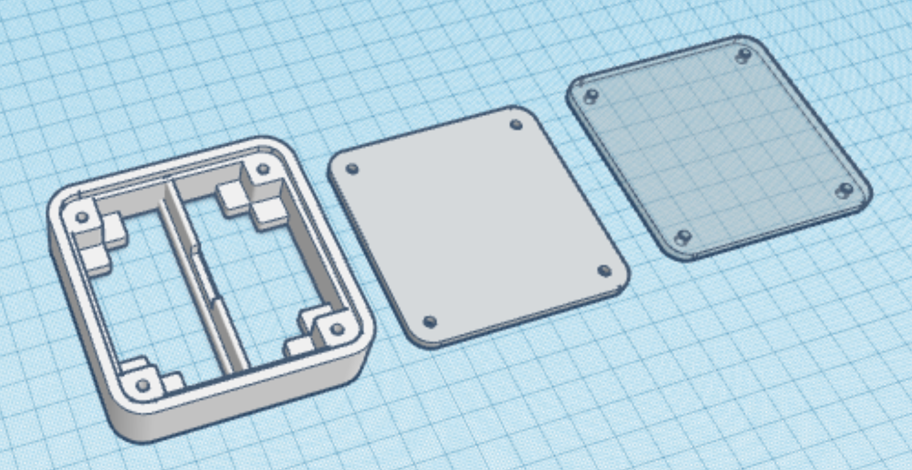
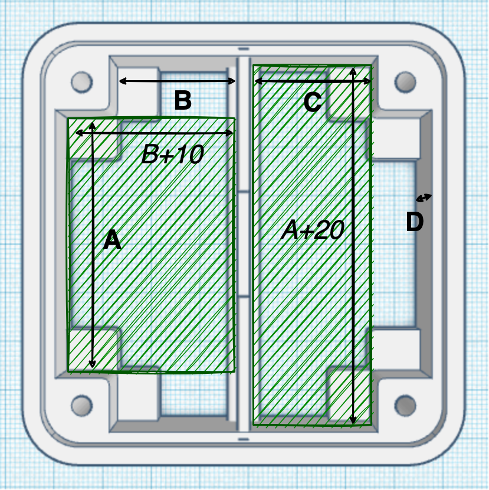

# Edge Case: Housing your sensors at the edge

## Objective
Often when developing IoT use cases, sensors and supporting boards are readily available,
but housing the electronics at the edge is a challenge. 

Would it be possible to develop
a easily scalable, (semi) professional case design that bridges the gap between early prototyping
and high volume deployments?

## Early prototype

## Features

- [ ] A base case-design with lasercut front and back and a 3D printed house
- [ ] A parametric implementation for automatic sizing to your PCB
- [ ] Adding an optional battery holder
- [ ] Adding connectors at the side
- [ ] Swapple back design: Table model, screw mounts, and DIN rail

## Scaling the case
Choose values for A, B and C so that your boards and/or battery holders fit, either vertically or horiontally, in the two slots.

## Roadmap for 1.0

- [ ] Connectors, (touch)buttons? 
- [ ] Status leds and ambient feedback?
- [ ] External sensor bay?

## Todo for 0.5

- [ ] Support melt insrt nuts? Or hex spacers to be inserted in screw holes?
- [ ] How to parameterize the SVG's (better)?
- [ ] Online version of the parametrization

## Version log

v0.2
- [X] Smoother/parallel circles
- [X] Better side thinknesses
- [X] Use screws for fixing front and back

v0.3 and v0.4
- [x] Smoother lines
- [x] Support horizontal and vertical placement
- [x] Parameterize towards PCB size + optional 2x 18650 battery holder

## Supported boards

| Board | A | B | C | D |
| ---|---|---|---|---|
| Firebeetle 2 + 18650 Battery Holder | 60 mm | 15.4 mm | 21 mm | 30 mm |

