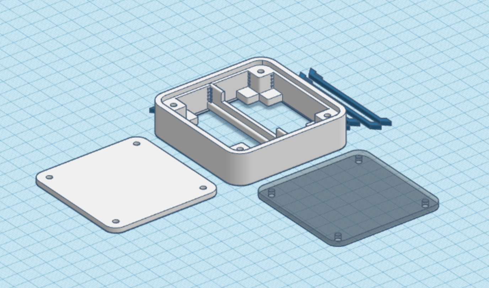

# Edge Case: Housing your sensors at the edge

This work is licensed under a Creative Commons Attribution-ShareAlike 4.0 International License.

## Objective

Often when developing IoT use cases, sensors and supporting boards are readily available,
but housing the electronics at the edge is a challenge.

Would it be possible to develop an easily scalable, (semi) professional case design that bridges the gap between early prototyping
and high volume deployments?

## Current version

## Features

- [ ] A base case-design with lasercut front and back and a 3D printed house
- [ ] A parametric implementation for automatic sizing to your specific PCB, battery holder, sensor, etc.
- [ ] Swappable back design: Table model, screw mounts, and DIN rail

## Scaling the case

Choose values for A, B, C and D so that your boards and/or battery holders fit, either vertically or horiontally, in the two slots.

## Roadmap for 1.0

- [ ] Connectors, (touch)buttons? 
- [ ] Status leds and ambient feedback?
- [ ] External sensor bay?
- [ ] How to parameterize the SVG's (better)?
- [ ] Online version of the design generator

## Todo for 0.5

- [x] Testing support for melt insert nuts
    - Ruthex M3 Schroefdraadbus M3 x 5.7
- [x] Small irregularity in the design at top left corner of the case.
- [x] Fixing the boards with a clip

## Version log

v0.2
- [X] Smoother/parallel circles
- [X] Better side thinknesses
- [X] Use screws for fixing front and back

v0.3 and v0.4
- [x] Smoother lines
- [x] Support horizontal and vertical placement
- [x] Parameterize towards PCB size + optional 2x 18650 battery holder

## Supported boards

| Board | A | B | C | D |
| ---|---|---|---|---|
| Firebeetle 2 (60x25.4mm, 62mm including protruding USB connector) + 18650 Battery Holder (80x21mm) | 62 mm | 16 mm | 21 mm | 30 mm |

## Contributors

Idea and design by Jeroen van Grondelle

With contributions and feedback from:
- Daan Boezeman
- ...